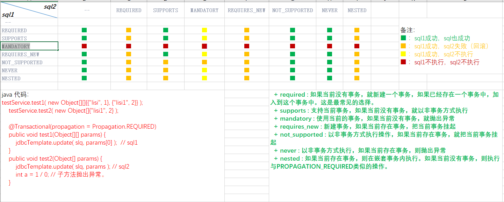
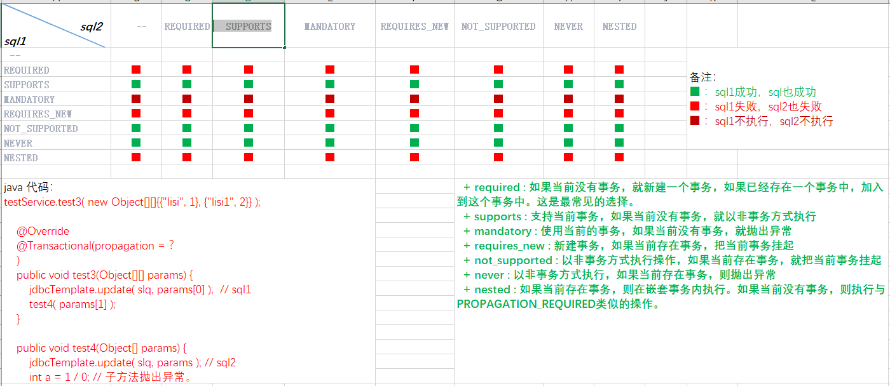
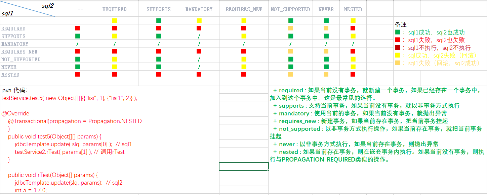
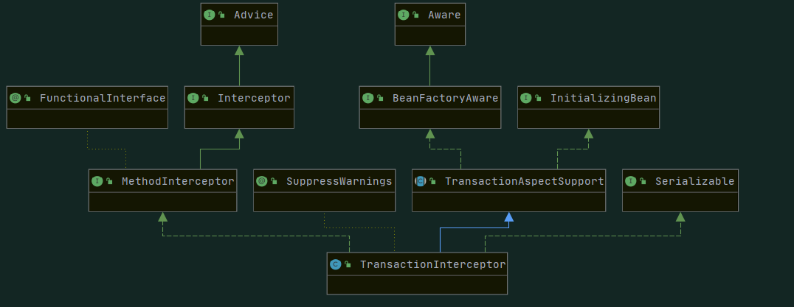
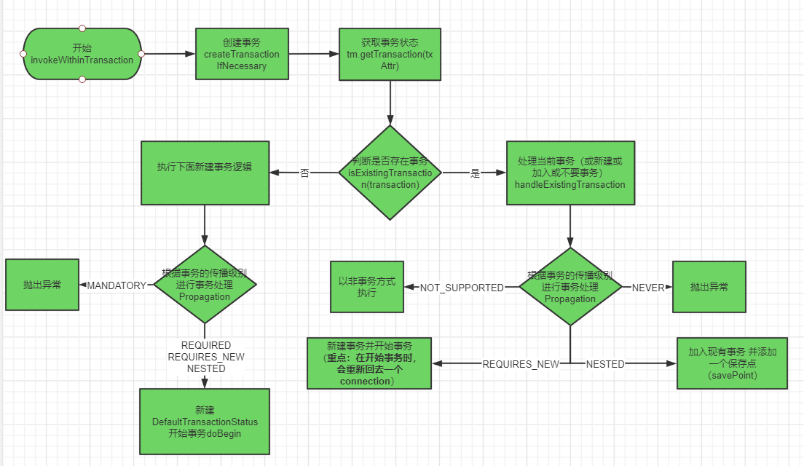

## 事务传播机制
### Ⅰ：传播机制（Propagation）
  + required : 如果当前没有事务，就新建一个事务，如果已经存在一个事务中，加入到这个事务中。这是最常见的选择。
  + supports : 支持当前事务，如果当前没有事务，就以非事务方式执行
  + mandatory : 使用当前的事务，如果当前没有事务，就抛出异常
  + requires_new : 新建事务，如果当前存在事务，把当前事务挂起
  + not_supported : 以非事务方式执行操作，如果当前存在事务，就把当前事务挂起
  + never : 以非事务方式执行，如果当前存在事务，则抛出异常
  + nested : 如果当前存在事务，则在嵌套事务内执行。如果当前没有事务，则执行与PROPAGATION_REQUIRED类似的操作。


### Ⅱ：spring-tx事务测试
#### 场景1：方法外调用测试(cglib代理)
```
    testService.test1( new Object[][]{{"lisi", 1}, {"lisi1", 2}} );
    testService.test2( new Object[]{"lisi1", 2} );
    
    @Transactional(propagation = Propagation.REQUIRED)
    public void test1(Object[][] params) {
        jdbcTemplate.update( slq, params[0] );  // sql1
    }
    public void test2(Object[] params) {
        jdbcTemplate.update( slq, params ); // sql2
        int a = 1 / 0; // 子方法抛出异常。
    }    
```
结果说明

+ 1.这种情况相当于两个方法分别执行，互不相干。相当于两条平行线，永不相交。
+ 2.这种情况和我们的Controller调用多个service是一个意思，就是test1和test2开启的事务是两个事务，两者方法的执行互不影响。
+ 3.MANDATORY全红的意义是：在事务开始时，没找到当前事务，事务管理器直接抛出异常，方法结束，所以两个方法根本还没来的急执行。

       
#### 场景2:方法内调用测试(cglib代理)
   ```
        testService.test1( new Object[][]{{"lisi", 1}, {"lisi1", 2}} );

        @Override
        @Transactional(propagation = Propagation.REQUIRED)
        public void test1(Object[][] params) {
            jdbcTemplate.update( slq, params[0] );  // sql1
            test2( params[1] );
        }
        public void test2(Object[] params) {
            jdbcTemplate.update( slq, params ); // sql2
            int a = 1 / 0; // 子方法抛出异常。
        }
   ```
结果说明

+ 1.这种情况相当于两个方法在同一个盒子里，一荣俱荣，一损俱损。相当于一条线，没有其他路可走。
+ 2.这种情况和我们的service里面调用方法是一样的，其实从结果图中我们可以得出结论：test1和test2的两个sql其实等价于test1中直接执行两个sql 。
```
public void test1(Object[][] params) {
            jdbcTemplate.update( slq, params[0] );  // sql1
            jdbcTemplate.update( slq, params[1] );  // sql2
        }
```
+ 3.从图中我们可以看出，在test2加上事务注解也是无效的，这是为什么呢？
+ 4.MANDATORY全红的意义和场景一是一样的。


#### 场景3***:方法内调用外部方法测试(cglib代理) 
```
testService.test5( new Object[][]{{"lisi", 1}, {"lisi1", 2}} );

@Override
    @Transactional(propagation = Propagation.NESTED
    )
    public void test5(Object[][] params) {
        jdbcTemplate.update( slq, params[0] );  // sql1
        testService2.rTest( params[1] ); // 调用rTest
    }
@Override
    @Transactional(propagation = Propagation.NESTED
    )
    public void rTest(Object[] params) {
        jdbcTemplate.update(slq, params);  // sql2
        int a = 1 / 0;
    }
```
结果说明

+ 1.这种情况情况比较多，需要具体问题具体分析。

#### 场景4***:语义重现
+1.requires_new
```
testService.test5();

@Transactional(propagation = Propagation.REQUIRES_NEW)
public void test5(Object[][] params) {
    jdbcTemplate.update(slq, new Object[]{"lisi1" , "1"});  // sql1
    testService2.test2(); // 调用rTest
    testService2.test3(); // 调用nTest
}

@Override
@Transactional(propagation = Propagation.REQUIRES_NEW)
public void test2() {
    jdbcTemplate.update(slq, new Object[]{"lisi2", "2"});  // sql2
}

@Transactional(propagation = Propagation.REQUIRES_NEW)
public void test3() {
    jdbcTemplate.update(slq, new Object[]{"lisi3", "3"});  // sql3
    int a = 1 / 0;
}

结果：sql1失败 sql2成功 sql3失败
```

#### 思考
+ 1.为什么场景1中的service执行互不影响？
+ 2.为什么场景2中的test2方法上的注解无效？ 
+ 3.为什么场景3中的（REQUIRED,--） 会都失败呢（回滚了）？
+ 4.为什么场景3中的（REQUIRED,REQUIRES_NEW） 会都失败呢（回滚了）？
+ 5.想一想我们在场景3中的 int a = 1 / 0; 加上异常处理后结果又会是啥？


#### 思考回答
+ 1.那是因为两个入口方法都是通过代理类进行调用的，两个方法都走了代理过程。
+ 2.那是因为入口方法test1在代理时生成代理类后，直接调用的代理类内部的test2方法，test2方法根本没有被代理。
  我们可以通过java的HSDB工具生成代理类来观察：java -classpath "%JAVA_HOME%/lib/sa-jdi.jar" sun.jvm.hotspot.HSDB
+ 3.因为TestService2Impl中的rTest()没有加任何事务机制，就造成了spring也不会对其生成代理类。
不生成代理类，就相当于普通方法调用，两个方法其实处在同一个事务中。
+ 4.不要被REQUIRES_NEW迷惑了这里，这里需要rTest()重启开了一个事务，
但是异常还是被test5方法捕获到了，所以两个方法的事务都回滚了 。
+ 5.看懂了3，4的说法，5应该就能理解了。

####  总结（******）
+ 1.如果方法调用是同类中的方法调用，则事务的传递属性以开始方法为准，其他方法上的事务将无效。
+ 2.如果外部方法不存在事务，则事务以各自的方法事务为准，互不干扰。
+ 3.如果外部存在事务，则以外部事务为准，当内部事务异常传递到外部方法时，将导致外部事务回滚。  
    比如(supports,requires_new,requires_new),当事务3抛出异常后，事务1在没有事务的情况下，即使捕获了事务3的异常，事务1也不会回滚；  
    比如(required,requires_new,requires_new),当事务3抛出异常后，事务1在有事务的情况下，其捕获了事务3的异常，事务1跟着回滚。
+ 4.如果外部存在事务，内部各自方法的各自事务互不影响。  
    比如(required,requires_new,requires_new),当事务3抛出异常后，事务2在新创建的独立事务下执行，无法捕获到事务3的异常，所以也不会回滚；  
    比如(required,required,requires_new),当事务3抛出异常后，事务2在和事务1同一个事务中执行时，事务1捕获到异常，所以事务1，2都会回滚。
+ 5.如果外部存在事务，外部事务无法影响内部事务  
    比如(required,requires_new,requires_new),当事务3抛出异常后，事务2，3在新创建的独立事务下执行，无法捕获到事务1的异常，所以2，3不会回滚；
+ 6.特别的嵌套事务，当有嵌套事务时，其和他有关联的事务都会被该事务影响。  
    比如(required,NESTED,NESTED),当事务3抛出异常后，事务1，2都被嵌套，3着事务都会被回滚。
    比如(required,requires_new,NESTED),当事务3抛出异常后，事务1，3被回滚，2正常提交。
    
## 事务的隔离级别（https://www.jianshu.com/p/271076b79ca8）
+ 1.READ_UNCOMMITTED 读取未提交数据(会出现脏读,不可重复读)： 一个事务可以读取另一个未提交事务的数据  读到了还未提交的数据就是脏读
+ 2.READ_COMMITTED 读取已提交数据(会出现不可重复读和幻读)：  一个事物范围内两个相同的查询却返回了不同数据，这就是不可重复读
+ 3.REPEATABLE_READ  可重复读(会出现幻读) 可重复读意义就是该事务无论都多少次该数据，该数据都返回一致。  幻读针对的insert操作
+ 4.SERIALIZABLE 串行化 效率低


## 事务原理
#### Ⅰ.事务初始化
###### 1.annotation-driven
+ 1.annotation-driven 起始于TxNamespaceHandler。使用AnnotationDrivenBeanDefinitionParser处理该配置
+ 2.AnnotationDrivenBeanDefinitionParser 通过调用AopAutoProxyConfigurer.configureAutoProxyCreator(element, parserContext)  
 方法实现将事务的相关管理bean的定义加入到BeanDefinition中.
###### 2.AnnotationTransactionAttributeSource (TransactionAttributeSource)
+ 1.AnnotationTransactionAttributeSource 其作用用于处理 @Transactional（SpringTransactionAnnotationParser或其他的JTA、EJB3等注解
+ 2.SpringTransactionAnnotationParser 其parseTransactionAnnotation()用于专门处理@Transactional注解.
###### 3.TransactionInterceptor 事务拦截器（最重要）.
+ 1.TransactionInterceptor extend TransactionAspectSupport.
+ 2.TransactionAspectSupport 的 currentTransactionStatus 是一个静态方法，外部可以直接调用用于获取到当前事务的状态，从而甚至可议手动来提交、回滚事务.
+ 3.invokeWithinTransaction() 执行事务方法，这个方法是最重要的方法.
###### 4.BeanFactoryTransactionAttributeSourceAdvisor 
+ 1.该方法将aop和事务结合在了一起，该方法返回一个事务切入点。因为该方法实现了advisor接口
+ 2.getPointcut()方法调用加入了TransactionAttributeSource的切入点。

#### Ⅱ.事务初始化流程
+ 1.首先是spring容器初始化bean，这个不多说了。
+ 2.在初始化(initializeBean->applyBeanPostProcessorsAfterInitialization)bean的时候，找到BeanPostProcessor并执行后置处理器方法进行bean增强。
+ 3.AbstractAutoProxyCreator.wrapIfNecessary()中执行了两个重要步骤：  
   + 1.getAdvicesAndAdvisorsForBean()获取advice,获取增强器。（俗话说我们要怎样增强我们的代码）。
       + 1.BeanFactoryTransactionAttributeSourceAdvisor.matches() 执行获取getTransactionAttributeSource().
       + 2.TransactionAttributeSource.getTransactionAttribute()方法，该方法将获取到增强方法的事务配置（TransactionAttribute）进行缓存，以待后续事务执行时使用
   + 2.createProxy() 根据配置创建代理类
https://blog.csdn.net/acingdreamer/article/details/91873745


#### Ⅲ.事务执行流程
+ 1.TransactionInterceptor首先我们看一下这个类的继承结构;其MethodInterceptor.invoke()方法就是执行入口。

+ 2.TransactionInterceptor.invokeWithinTransaction().
    + 1.获取TransactionAttributeSource
    + 2.tas.getTransactionAttribute(method, targetClass) 获取该方法时事务配置
    + 3.determineTransactionManager() 返回处理事务的事务管理器
    + 4 TransactionInfo txInfo = createTransactionIfNecessary(tm, txAttr, joinpointIdentification);重点。
    创建这次事务的相关信息，添加事务属性和事务管理器，设置事务状态等。
        + 1.getTransaction() 解析当前方法的事务属性定义，解析事务的传播属性。方法分为三个逻辑：没有事务抛出异常，创建事务，不需要事务。如果  
        存在事务，则走调用handleExistingTransaction(definition, transaction, debugEnabled)的逻辑，如果不存在事务则走下面的逻辑，按  
        传播事务特性处理事务。
    + 5.invocation.proceedWithInvocation() 执行代理方法
    + 6.completeTransactionAfterThrowing(txInfo, ex); 代理方法执行异常后处理异常（事务回滚等）。注意这里会抛出异常，这也是为什么父类事务会滚回的原因
    + 7.cleanupTransactionInfo(txInfo); 清理事务执行信息。
    + 8.commitTransactionAfterReturning(txInfo); 正常执行就提交事务。
+ 3.事务传播逻辑流程图(createTransactionIfNecessary)
        
            