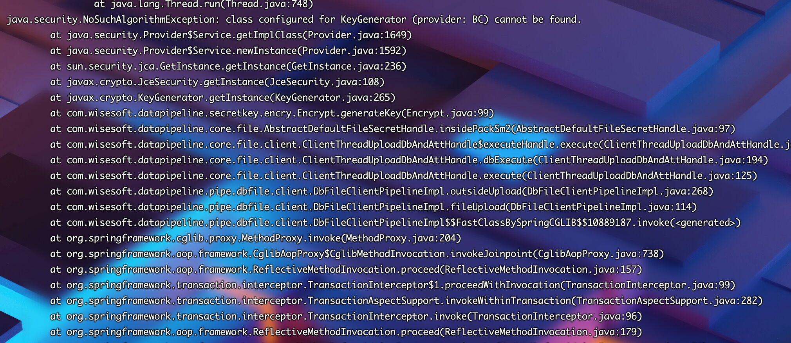

# 该错误记录一次线上SM4加解密错误

## 1.问题描述

> 具体描述：java.security.NoSuchProviderException: Provider 'BC' not found 。如下图：



实现代码

``` 
    static {
        if (Security.getProvider(BouncyCastleProvider.PROVIDER_NAME) == null) {
            //No such provider: BC
            Security.addProvider(new BouncyCastleProvider());
        }
    }
    
    public static byte[] generateKey(int keySize)
            throws Exception {
        KeyGenerator kg = KeyGenerator.getInstance("SM4", "BC");
        kg.init(keySize, new SecureRandom());
        return kg.generateKey().getEncoded();
    }
```

> **问题描述：在tomcat中，当热部署项目时，就会出现截图中的错误问题。如果重启就可以结局该问题， 但是有个问题就是当项目多了的时候，热部署势必要的， 每次重启服务会浪费很多时间。所以现在我们来解决热部署导致的这个问题。**

## 2.问题处理过程

### 2.1 解决办法思路（猜想）

#### 2.1.1 修改jdk配置（缺点：每次部署都要修改jdk，而且修改不可见，不友好）

> 1.将bcprov-jdk15on-1.59.jar放入JAVA_HOME/jre/lib/ext下
> 2.打开JAVA_HOME/jre/lib/security下的java.security文件，在下面加上 security.provider.10=org.bouncycastle.jce.provider.BouncyCastleProvider

#### 2.1.2 修改代码（最简单）

> 调用 generateKey()方法时，执行static中的代码进行检测，不再写成静态方法

#### 2.1.2 修改代码框架结构（缺点：修改工作量大）

> 因为加解密代码是个固定代码，基本上不会改动，所以可以独立出去，然后单独部署减少其热部署机会。业务层单独调用。

### 2.2 思路验证

### 2.2.1 修改jdk配置(本机mac验证)

+ 环境准备：jdk8,tomcat9,项目war包。
+ 启动项目，
+ 遇到的问题：

> 1.nested exception is java.lang.NoClassDefFoundError: javax/xml/bind/ValidationException
> 处理办法：启动后发现本地jdk被升级到jdk16，使用：/usr/libexec/java_home -V 查看本地安装所有安装版本和默认使用版本。
> 切换到jkd8：参考：mac_cmd.md/配置jdk切换